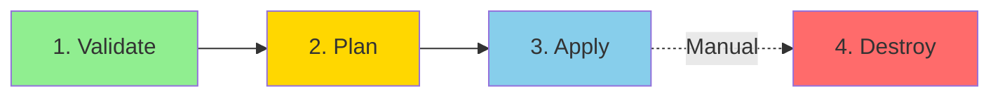
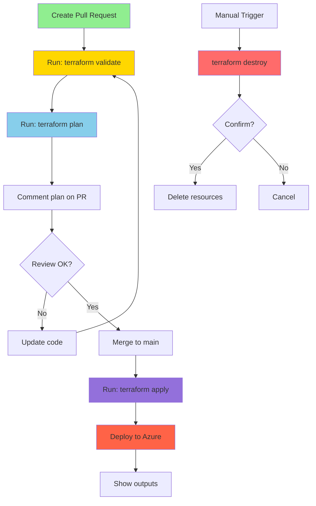

# 🚀 Complete Guide: CI/CD Pipeline Setup

This guide provides **step-by-step instructions** for setting up a GitHub Actions pipeline to deploy your Azure infrastructure using Terraform.

---

## 📚 Table of Contents

1. [What does this pipeline do?](#what-does-this-pipeline-do)
2. [Prerequisites](#prerequisites)
3. [Azure Configuration](#azure-configuration)
4. [GitHub Configuration](#github-configuration)
5. [Terraform Backend Setup](#terraform-backend-setup)
6. [Using the Pipeline](#using-the-pipeline)
7. [Troubleshooting](#troubleshooting)

---

## 🎯 What does this pipeline do?

The pipeline automates infrastructure deployment using **Terraform** and **GitHub Actions**. It has 4 main workflows:



### Workflow 1: **Validate** 🔍
- ✅ Checks code format (`terraform fmt`)
- ✅ Initializes Terraform
- ✅ Validates syntax (`terraform validate`)
- ✅ Comments results on Pull Requests

### Workflow 2: **Plan** 📋
- 📊 Authenticates with Azure
- 📊 Generates a change plan (`terraform plan`)
- 📊 Shows which resources will be created/modified/deleted
- 📊 Saves the plan for the next step

### Workflow 3: **Apply** 🚀
- 🚀 Runs ONLY on `main` branch or manual trigger
- 🚀 Applies changes to Azure (`terraform apply`)
- 🚀 Creates the actual infrastructure
- 🚀 Displays outputs (URLs, IPs, resource names)

### Workflow 4: **Destroy** 💥
- 💥 **Manual trigger only** (for safety)
- 💥 Destroys all infrastructure
- 💥 Requires approval
- 💥 Displays what will be deleted

---

## 📋 Prerequisites

Before starting, ensure you have:

- ✅ **Azure Subscription** with permissions to create resources
- ✅ **GitHub Account** with repository access (Owner or Admin role)
- ✅ **Azure CLI** installed on your computer ([Download](https://learn.microsoft.com/en-us/cli/azure/install-azure-cli))
- ✅ **Git** installed and configured
- ✅ Basic knowledge of Terraform and YAML

---

## ☁️ Azure Configuration

### Step 1: Login to Azure

Open your terminal and run:

```bash
# Login to Azure
az login

# Verify you're in the correct subscription
az account show

# If needed, set the correct subscription
az account set --subscription "Your-Subscription-Name"
```

You should see output like:

```json
{
  "id": "12345678-1234-1234-1234-123456789012",
  "name": "Your Subscription Name",
  "state": "Enabled",
  "tenantId": "87654321-4321-4321-4321-210987654321"
}
```

---

### Step 2: Create a Service Principal

A **Service Principal** is like a "service account" that GitHub Actions will use to deploy resources to Azure.

#### 2.1 Get your Subscription ID

```bash
SUBSCRIPTION_ID=$(az account show --query id -o tsv)
echo "Your Subscription ID: $SUBSCRIPTION_ID"
```

**Save this ID** - you'll need it later!

#### 2.2 Create the Service Principal

```bash
az ad sp create-for-rbac \
  --name "github-actions-terraform-sp" \
  --role "Contributor" \
  --scopes "/subscriptions/$SUBSCRIPTION_ID" \
  --sdk-auth
```

**❗ IMPORTANT:** This command will output JSON credentials. **Copy ALL of it!**

Example output:

```json
{
  "clientId": "00000000-0000-0000-0000-000000000000",
  "clientSecret": "abc123def456ghi789",
  "subscriptionId": "12345678-1234-1234-1234-123456789012",
  "tenantId": "87654321-4321-4321-4321-210987654321",
  "activeDirectoryEndpointUrl": "https://login.microsoftonline.com",
  "resourceManagerEndpointUrl": "https://management.azure.com/",
  ...
}
```

**⚠️ WARNING:** Never commit these credentials to Git!

---

### Step 3: Grant Additional Permissions

The Service Principal needs extra permissions to manage Key Vault and Managed HSM:

#### 3.1 Get the Service Principal Object ID

```bash
SP_OBJECT_ID=$(az ad sp list --display-name "github-actions-terraform-sp" --query "[0].id" -o tsv)
echo "Service Principal Object ID: $SP_OBJECT_ID"
```

#### 3.2 Assign Key Vault Administrator Role

```bash
az role assignment create \
  --assignee-object-id "$SP_OBJECT_ID" \
  --assignee-principal-type ServicePrincipal \
  --role "Key Vault Administrator" \
  --scope "/subscriptions/$SUBSCRIPTION_ID"
```

You should see:

```json
{
  "principalId": "...",
  "roleDefinitionId": "...",
  "scope": "/subscriptions/..."
}
```

✅ **Success!** Your Service Principal is ready.

---

## 🔐 GitHub Configuration

Now we'll configure GitHub to use the Azure credentials securely.

### Step 1: Navigate to Repository Settings

1. Go to your repository: **`https://github.com/sihbher/odaa-akv-tests`**
2. Click **"Settings"** tab (top right)
3. Look for **"Secrets and variables"** in the left sidebar
4. Click **"Actions"**

You should see a page like this:

```
┌─────────────────────────────────────┐
│ Actions secrets and variables        │
├─────────────────────────────────────┤
│ Secrets    Variables    Environments │
├─────────────────────────────────────┤
│ No repository secrets                │
│                                      │
│ [New repository secret]              │
└─────────────────────────────────────┘
```

---

### Step 2: Add Azure Credentials Secret

This is the **most important** secret - it contains all Azure authentication info.

1. Click **"New repository secret"**
2. **Name:** `AZURE_CREDENTIALS`
3. **Secret:** Paste the **entire JSON output** from Step 2.2 (Service Principal creation)
4. Click **"Add secret"**

**Example:**

```
Name: AZURE_CREDENTIALS

Secret:
{
  "clientId": "00000000-0000-0000-0000-000000000000",
  "clientSecret": "abc123def456ghi789",
  "subscriptionId": "12345678-1234-1234-1234-123456789012",
  "tenantId": "87654321-4321-4321-4321-210987654321",
  ...
}
```

---

### Step 3: Add Individual Secrets

For better security and flexibility, also add these individual secrets:

#### Secret 1: AZURE_CLIENT_ID

1. Click **"New repository secret"**
2. **Name:** `AZURE_CLIENT_ID`
3. **Secret:** Copy the `clientId` value from the JSON (from Step 2.2)
4. Click **"Add secret"**

#### Secret 2: AZURE_CLIENT_SECRET

1. Click **"New repository secret"**
2. **Name:** `AZURE_CLIENT_SECRET`
3. **Secret:** Copy the `clientSecret` value from the JSON
4. Click **"Add secret"**

#### Secret 3: AZURE_SUBSCRIPTION_ID

1. Click **"New repository secret"**
2. **Name:** `AZURE_SUBSCRIPTION_ID`
3. **Secret:** Copy the `subscriptionId` value from the JSON (or use the value from Step 2.1)
4. Click **"Add secret"**

#### Secret 4: AZURE_TENANT_ID

1. Click **"New repository secret"**
2. **Name:** `AZURE_TENANT_ID`
3. **Secret:** Copy the `tenantId` value from the JSON
4. Click **"Add secret"**

**✅ You should now have 5 secrets:**

| Secret Name | Purpose |
|-------------|---------|
| `AZURE_CREDENTIALS` | Full JSON credentials (legacy format) |
| `AZURE_CLIENT_ID` | Service Principal App ID |
| `AZURE_CLIENT_SECRET` | Service Principal Password |
| `AZURE_SUBSCRIPTION_ID` | Your Azure Subscription ID |
| `AZURE_TENANT_ID` | Your Azure AD Tenant ID |

---

### Step 4: Add Terraform Backend Secrets (Recommended)

To store Terraform state remotely (highly recommended for teams), add these secrets:

#### What is Terraform State?

Terraform keeps track of your infrastructure in a **state file**. By default, this file is stored locally, but for CI/CD, you need to store it in Azure Storage so it's accessible from anywhere.

First, create the storage account (see [Terraform Backend Setup](#terraform-backend-setup) section), then add these secrets:

| Secret Name | Example Value | Description |
|-------------|---------------|-------------|
| `TERRAFORM_BACKEND_RESOURCE_GROUP` | `rg-terraform-state` | Resource group for state storage |
| `TERRAFORM_BACKEND_STORAGE_ACCOUNT` | `sttfstateeastus001` | Storage account name (globally unique) |
| `TERRAFORM_BACKEND_CONTAINER_NAME` | `tfstate` | Blob container name |
| `TERRAFORM_BACKEND_KEY` | `exascale-akv.tfstate` | State file name |

**Steps to add each:**

1. Click **"New repository secret"**
2. Enter the **Name**
3. Enter the **Secret** value
4. Click **"Add secret"**
5. Repeat for all 4 secrets

---

### Step 5: Add Configuration Variables (Optional)

For non-sensitive configuration values, use **Variables** instead of secrets:

1. Stay on the **"Secrets and variables"** → **"Actions"** page
2. Click the **"Variables"** tab (next to Secrets tab)
3. Click **"New repository variable"**

Add these recommended variables:

| Variable Name | Example Value | Description |
|---------------|---------------|-------------|
| `AZURE_LOCATION` | `eastus` | Default Azure region |
| `TERRAFORM_VERSION` | `1.6.0` | Terraform version to use |
| `ENVIRONMENT` | `dev` | Environment name (dev/staging/prod) |

**Why use Variables instead of Secrets?**

- **Variables** are visible in logs (good for debugging)
- **Secrets** are masked in logs (good for sensitive data)

---

## 🗄️ Terraform Backend Setup

Storing Terraform state in Azure ensures team members and CI/CD can share the same state.

### Step 1: Create Storage Account

Run these commands in your terminal:

```bash
# Set variables
RESOURCE_GROUP="rg-terraform-state"
LOCATION="eastus"
# Generate unique storage account name (must be globally unique)
STORAGE_ACCOUNT="sttfstate$(date +%s | tail -c 7)"
CONTAINER_NAME="tfstate"

# Create resource group
az group create \
  --name "$RESOURCE_GROUP" \
  --location "$LOCATION"

# Create storage account
az storage account create \
  --resource-group "$RESOURCE_GROUP" \
  --name "$STORAGE_ACCOUNT" \
  --location "$LOCATION" \
  --sku Standard_LRS \
  --encryption-services blob \
  --https-only true \
  --min-tls-version TLS1_2 \
  --allow-blob-public-access false

# Get storage account key
ACCOUNT_KEY=$(az storage account keys list \
  --resource-group "$RESOURCE_GROUP" \
  --account-name "$STORAGE_ACCOUNT" \
  --query "[0].value" -o tsv)

# Create blob container
az storage container create \
  --name "$CONTAINER_NAME" \
  --account-name "$STORAGE_ACCOUNT" \
  --account-key "$ACCOUNT_KEY"

# Display summary
echo "✅ Terraform Backend Created!"
echo ""
echo "Resource Group: $RESOURCE_GROUP"
echo "Storage Account: $STORAGE_ACCOUNT"
echo "Container Name: $CONTAINER_NAME"
echo ""
echo "⚠️  SAVE THESE VALUES - Add them to GitHub Secrets!"
```

**✅ Success!** You should see output like:

```
✅ Terraform Backend Created!

Resource Group: rg-terraform-state
Storage Account: sttfstate1234567
Container Name: tfstate

⚠️  SAVE THESE VALUES - Add them to GitHub Secrets!
```

---

### Step 2: Grant Service Principal Access to Storage

```bash
# Get Service Principal Object ID (if you don't have it)
SP_OBJECT_ID=$(az ad sp list --display-name "github-actions-terraform-sp" --query "[0].id" -o tsv)

# Grant Storage Blob Data Contributor role
az role assignment create \
  --assignee-object-id "$SP_OBJECT_ID" \
  --assignee-principal-type ServicePrincipal \
  --role "Storage Blob Data Contributor" \
  --scope "/subscriptions/$SUBSCRIPTION_ID/resourceGroups/$RESOURCE_GROUP/providers/Microsoft.Storage/storageAccounts/$STORAGE_ACCOUNT"
```

✅ **Done!** Now GitHub Actions can read/write Terraform state.

---

### Step 3: Configure Backend in Terraform

The workflow files will configure the backend automatically using the secrets you added.

**Optional:** You can also add backend configuration to your Terraform code:

Create file: `infra-deployment/backend.tf`

```hcl
terraform {
  backend "azurerm" {
    # Configuration will be provided via environment variables in GitHub Actions
    # Or uncomment and fill in for local development:
    # resource_group_name  = "rg-terraform-state"
    # storage_account_name = "sttfstateXXXXXXX"
    # container_name       = "tfstate"
    # key                  = "exascale-akv.tfstate"
  }
}
```

---

## 🚀 Using the Pipeline

### First-Time Setup

1. **Ensure all secrets and variables are configured** (Steps above ✅)

2. **Push the workflow files to GitHub:**

```bash
cd "/Users/gerardoreyes/Microsoft/CSA-e/Engineering/Oracle/Tests/ADB - AKV Private Endpoint /repo"
git add .github/workflows/
git commit -m "Add GitHub Actions CI/CD pipeline"
git push origin main
```

3. **Verify workflows are registered:**
   - Go to your repository on GitHub
   - Click **"Actions"** tab
   - You should see your workflows listed:
     - ✅ Terraform Validate
     - ✅ Terraform Plan
     - ✅ Terraform Apply
     - ✅ Terraform Destroy

---

### Option 1: Deploy via Pull Request (Recommended)

This is the **safest** way - it lets you review changes before deploying.

#### Step 1: Create a Feature Branch

```bash
git checkout -b feature/update-infrastructure
```

#### Step 2: Make Changes

Edit your Terraform files (e.g., `variables.tf`, `main.tf`, etc.)

#### Step 3: Commit and Push

```bash
git add .
git commit -m "Update infrastructure: enable Managed HSM"
git push origin feature/update-infrastructure
```

#### Step 4: Create Pull Request

1. Go to your repository on GitHub
2. You'll see a banner: **"Compare & pull request"** - click it
3. Add a title and description
4. Click **"Create pull request"**

#### Step 5: Review the Plan

GitHub Actions will automatically:
1. ✅ Validate your code
2. 📋 Generate a Terraform plan
3. 💬 Comment the plan on your PR

**Example comment:**

```
## Terraform Plan

Plan: 5 to add, 2 to change, 0 to destroy

### Resources to be created:
+ azurerm_key_vault_managed_hardware_security_module.mhsm
+ azurerm_private_endpoint.mhsm
...

### Resources to be modified:
~ azurerm_key_vault.main
  ~ tags = {
      + "UpdatedBy" = "Terraform"
    }
```

#### Step 6: Merge to Deploy

1. Review the plan carefully
2. If everything looks good, click **"Merge pull request"**
3. Click **"Confirm merge"**
4. GitHub Actions will automatically deploy to Azure 🚀

---

### Option 2: Deploy Directly from Main

**⚠️ Warning:** This bypasses review - use only if you're sure!

```bash
# Make changes
git add .
git commit -m "Quick fix"

# Push directly to main
git push origin main
```

The pipeline will automatically:
1. Validate
2. Plan
3. Apply to Azure

---

### Option 3: Manual Deployment

You can manually trigger any workflow:

#### Step 1: Go to Actions Tab

1. Open your repository on GitHub
2. Click **"Actions"** tab
3. Select the workflow you want to run (e.g., "Terraform Apply")

#### Step 2: Run the Workflow

1. Click **"Run workflow"** button (right side)
2. Select branch (usually `main`)
3. (Optional) Adjust any input parameters
4. Click **"Run workflow"**

#### Step 3: Monitor Execution

1. Click on the running workflow
2. Click on a job (e.g., "terraform-apply")
3. View real-time logs
4. See each step execute

---

### Destroying Infrastructure

**⚠️ CAUTION:** This will delete ALL resources!

#### Step 1: Go to Actions

1. Repository → **Actions** tab
2. Select **"Terraform Destroy"** workflow
3. Click **"Run workflow"**

#### Step 2: Confirm

1. Select `main` branch
2. Check the **"Confirm Destroy"** checkbox
3. Click **"Run workflow"**

#### Step 3: Verify

The workflow will:
1. Show what will be destroyed
2. Wait for approval (if configured)
3. Destroy all resources
4. Display confirmation

---

## 🔍 Monitoring Pipeline Execution

### Viewing Workflow Runs

1. Go to **Actions** tab
2. You'll see a list of workflow runs:

```
✅ Terraform Apply (#42) - main - 2 minutes ago
✅ Terraform Plan (#41) - feat/update - 5 minutes ago
❌ Terraform Validate (#40) - fix/typo - 10 minutes ago
```

### Viewing Job Details

1. Click on a workflow run
2. You'll see all jobs:

```
┌─────────────────────────────┐
│ terraform-validate    ✅ 45s │
│ terraform-plan        ✅ 1m  │
│ terraform-apply       ✅ 8m  │
└─────────────────────────────┘
```

3. Click a job to see detailed logs
4. Each step shows:
   - ✅ Step name
   - ⏱️ Duration
   - 📄 Output logs

### Understanding Log Output

**Example log:**

```
Run hashicorp/setup-terraform@v3
  with:
    terraform_version: 1.6.0
✅ Terraform 1.6.0 installed

Run terraform init
  Initializing the backend...
  Initializing provider plugins...
  - Installing hashicorp/azurerm v3.80.0...
✅ Terraform has been successfully initialized!

Run terraform plan
  Refreshing state...
  Plan: 12 to add, 0 to change, 0 to destroy
✅ Plan generated successfully
```

---

## 🛠️ Troubleshooting

### Issue 1: Authentication Failed

**Error:**

```
Error: login failed with Error: Unable to get ACTIONS_ID_TOKEN_REQUEST_URL
```

**Causes:**
- GitHub secrets not configured correctly
- Service Principal credentials expired
- Wrong tenant ID

**Solutions:**

1. **Verify Secrets:**
   ```bash
   # In GitHub: Settings → Secrets and variables → Actions
   # Check all 5 secrets exist and have correct values
   ```

2. **Test Service Principal Locally:**
   ```bash
   az login --service-principal \
     --username <AZURE_CLIENT_ID> \
     --password <AZURE_CLIENT_SECRET> \
     --tenant <AZURE_TENANT_ID>
   ```

3. **Recreate Service Principal:**
   ```bash
   # Delete old one
   az ad sp delete --id <CLIENT_ID>
   
   # Create new one (repeat Step 2 from Azure Configuration)
   ```

---

### Issue 2: Terraform Backend Access Denied

**Error:**

```
Error: Failed to get existing workspaces: storage: service returned error: StatusCode=403
```

**Cause:** Service Principal doesn't have access to storage account

**Solution:**

```bash
# Get values
SP_OBJECT_ID=$(az ad sp list --display-name "github-actions-terraform-sp" --query "[0].id" -o tsv)
STORAGE_ACCOUNT="your-storage-account-name"
RESOURCE_GROUP="rg-terraform-state"

# Grant access
az role assignment create \
  --assignee-object-id "$SP_OBJECT_ID" \
  --assignee-principal-type ServicePrincipal \
  --role "Storage Blob Data Contributor" \
  --scope "/subscriptions/$SUBSCRIPTION_ID/resourceGroups/$RESOURCE_GROUP/providers/Microsoft.Storage/storageAccounts/$STORAGE_ACCOUNT"
```

---

### Issue 3: Resource Already Exists

**Error:**

```
Error: A resource with the ID "/subscriptions/.../resourceGroups/rg-exascale-eastus-123" already exists
```

**Cause:** Resource exists in Azure but not in Terraform state

**Solutions:**

**Option A: Import Existing Resource**

```bash
# Locally (for testing)
cd infra-deployment
terraform import azurerm_resource_group.main /subscriptions/.../resourceGroups/rg-exascale-eastus-123
terraform plan
```

**Option B: Let Terraform Recreate**

1. Delete resource from Azure Portal
2. Re-run pipeline

**Option C: Change Resource Name**

Edit `variables.tf` or use different suffix

---

### Issue 4: Terraform State Lock

**Error:**

```
Error: Error acquiring the state lock
Lock Info:
  ID:        abc123-def456-ghi789
  Operation: OperationTypePlan
  Who:       github-actions@v1
  Created:   2025-12-12 10:30:00 UTC
```

**Cause:** Another pipeline run is in progress or crashed

**Solutions:**

**Option A: Wait**

The lock usually releases after 15 minutes

**Option B: Force Unlock (Dangerous!)**

```bash
# Only if you're SURE no other operations are running
terraform force-unlock abc123-def456-ghi789
```

**Option C: Use GitHub Concurrency**

The workflow already has concurrency control:

```yaml
concurrency:
  group: terraform-${{ github.ref }}
  cancel-in-progress: true
```

---

### Issue 5: Terraform Format Check Failed

**Error:**

```
Error: terraform fmt check failed
Files need formatting:
  - main.tf
  - variables.tf
```

**Solution:**

```bash
# Format all files locally
cd infra-deployment
terraform fmt -recursive

# Commit and push
git add .
git commit -m "Fix Terraform formatting"
git push
```

---

### Issue 6: Missing Required Variables

**Error:**

```
Error: No value for required variable
  on variables.tf line 5:
   5: variable "location" {
```

**Cause:** Variable not set in workflow or `terraform.tfvars`

**Solution:**

Add to workflow file:

```yaml
env:
  TF_VAR_location: ${{ vars.AZURE_LOCATION || 'eastus' }}
  TF_VAR_enable_managed_hsm: ${{ vars.ENABLE_MANAGED_HSM || 'false' }}
```

Or create `terraform.tfvars`:

```hcl
location = "eastus"
enable_managed_hsm = false
```

---

### Issue 7: Timeout

**Error:**

```
Error: timeout while waiting for resource to be ready
```

**Solution:**

Increase timeout in workflow:

```yaml
- name: Terraform Apply
  run: terraform apply -auto-approve -lock-timeout=30m
  timeout-minutes: 60
```

---

### Debug Mode

To enable verbose logging, add this to your workflow:

```yaml
env:
  TF_LOG: DEBUG
  ARM_DEBUG: true
  ACTIONS_STEP_DEBUG: true
```

Then re-run the workflow to see detailed logs.

---

## ✅ Security Best Practices

### DO ✅

- ✅ **Use GitHub Secrets** for all sensitive data
- ✅ **Enable Branch Protection** on `main`:
  - Settings → Branches → Add rule
  - Require pull request reviews before merging
  - Require status checks to pass
- ✅ **Use Service Principal** with least-privilege access
- ✅ **Enable State Encryption** (Azure Storage automatically encrypts)
- ✅ **Review Plans** before applying
- ✅ **Use Separate Environments** (dev, staging, prod)
- ✅ **Enable Audit Logging** in Azure
- ✅ **Rotate Credentials** regularly
- ✅ **Use `.gitignore`** for sensitive files

### DON'T ❌

- ❌ **Don't commit secrets** to Git
- ❌ **Don't use personal credentials** in pipelines
- ❌ **Don't auto-approve** destructive changes
- ❌ **Don't skip** Terraform plan review
- ❌ **Don't store state locally** in production
- ❌ **Don't share** Service Principal credentials
- ❌ **Don't bypass** PR reviews
- ❌ **Don't hardcode** passwords in code

---

## 📊 Pipeline Workflow Visualization



---

## 📝 Next Steps

After setup is complete:

1. ✅ **Test the Pipeline**
   - Create a test PR
   - Review the plan
   - Merge and deploy

2. ✅ **Configure Branch Protection**
   - Require reviews
   - Require status checks
   - Restrict who can push to `main`

3. ✅ **Set Up Notifications**
   - Slack integration
   - Email notifications
   - Microsoft Teams webhook

4. ✅ **Create Environments**
   - GitHub Environments (dev, staging, prod)
   - Environment-specific secrets
   - Deployment protection rules

5. ✅ **Document Your Workflow**
   - Update README
   - Add deployment runbook
   - Document rollback procedures

6. ✅ **Plan for Scaling**
   - Multiple environments
   - Reusable workflows
   - Terraform modules

---

## 📚 Additional Resources

### Official Documentation

- [GitHub Actions Documentation](https://docs.github.com/en/actions)
- [Terraform Azure Provider](https://registry.terraform.io/providers/hashicorp/azurerm/latest/docs)
- [Azure Service Principal](https://learn.microsoft.com/en-us/cli/azure/create-an-azure-service-principal-azure-cli)
- [GitHub Actions for Azure](https://learn.microsoft.com/en-us/azure/developer/github/github-actions)

### Tutorials

- [Getting Started with GitHub Actions](https://docs.github.com/en/actions/learn-github-actions)
- [Terraform on Azure Tutorial](https://learn.hashicorp.com/collections/terraform/azure-get-started)
- [Azure Key Vault with Terraform](https://registry.terraform.io/providers/hashicorp/azurerm/latest/docs/resources/key_vault)

### Community

- [GitHub Actions Community](https://github.community/c/code-to-cloud/github-actions)
- [Terraform Community](https://discuss.hashicorp.com/c/terraform-core)
- [Azure Community](https://techcommunity.microsoft.com/t5/azure/ct-p/Azure)

---

## 🎓 Learning Path


---

**Last Updated:** December 12, 2025  
**Version:** 1.0  
**Repository:** odaa-akv-tests  
**Author:** Pipeline Setup Guide

---

💡 **Questions?** Open an issue in the repository or check the [Troubleshooting](#troubleshooting) section.

🎉 **Happy Deploying!**


