# Oracle Exascale with Azure Key Management over Private Endpoints

This repository provides comprehensive infrastructure-as-code (Terraform) and step-by-step guides for configuring Oracle Autonomous Database (ODAA) with Azure key management services using private endpoints for enhanced security.

## 🆕 Recent Updates (February 2026)

- **ADB Naming Fix (legacy)**: Auto-generated names now follow pattern `adbsakvtest[random]` (e.g., `adbsakvtest875`)
- **Terraform Variables**: Always generates complete `autonomous_database_config` block in tfvars
- **HSM Output**: Added missing `managed_hsm` output to Terraform for proper HSM configuration
- **HSM Activation**: Improved detection of HSM activation state and Security Domain handling
- **HSM Connection Info**: Enhanced display of HSM FQDN, Private Endpoint IP, and DNS records
- **Destroy Command**: Shows concise resource list instead of full JSON output
- **Script Behavior**: Fixed `configure_managed_hsm` to use `return` instead of `exit` for proper flow

## 📋 Table of Contents

- [Architecture Overview](#architecture-overview)
- [Scenarios](#scenarios)
- [Infrastructure Components](#infrastructure-components)
- [Security Benefits](#security-benefits)
- [Prerequisites](#prerequisites)
- [Quick Start](#quick-start)
- [Deployment Workflow](#deployment-workflow)
- [Configuration Options](#configuration-options)
- [Documentation Structure](#documentation-structure)

## 🏗️ Architecture Overview

This solution implements a secure, production-ready architecture where all components communicate over private connectivity within Azure's backbone network.

### High-Level Architecture

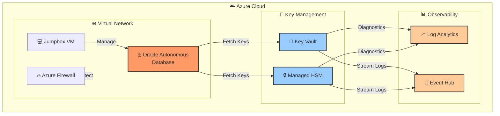

### Network Architecture with Private Endpoints

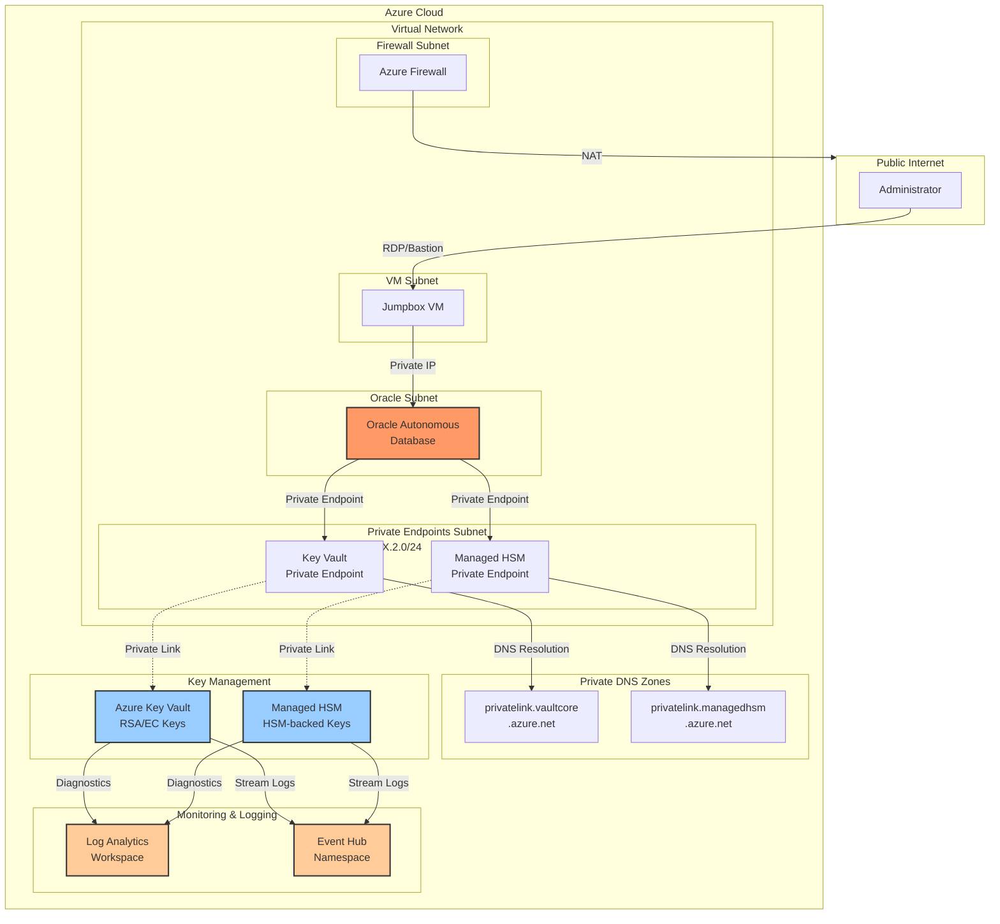

### Key Components Flow

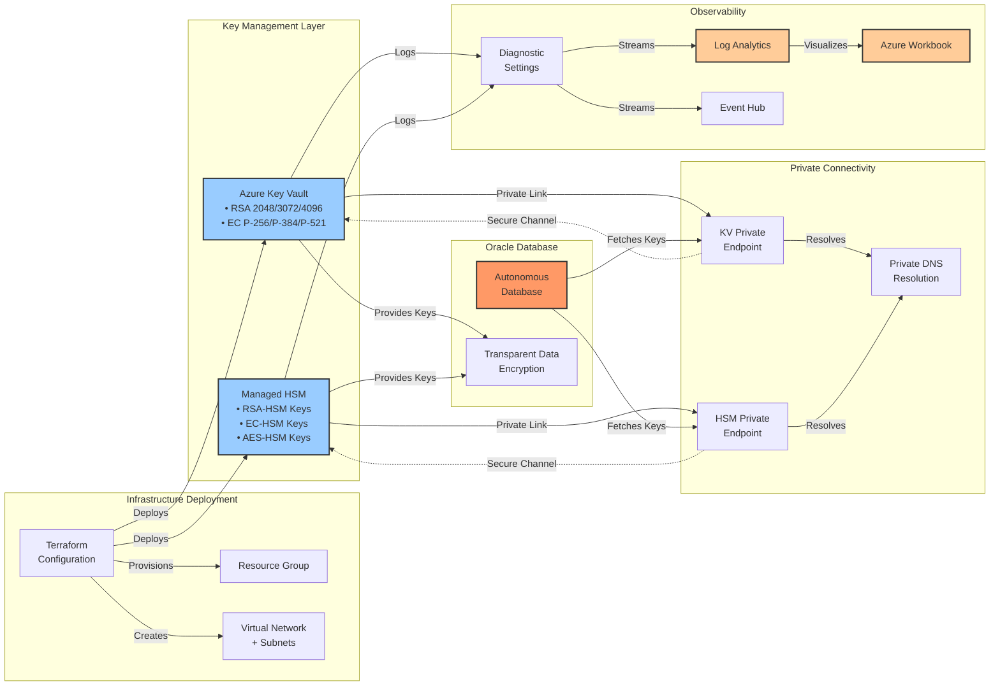

## 📚 Scenarios

This guide covers two secure key management scenarios:

### Scenario 1: Azure Key Vault with Private Endpoints
**[→ Step-by-Step Guide](./Step-by-step.md)**

- ✅ Configure customer-managed encryption keys using Azure Key Vault
- ✅ Implement private endpoint connectivity
- ✅ Multiple key types: RSA (2048/3072/4096), EC (P-256/P-256K/P-384/P-521)
- ✅ Automated key rotation policies (30-day expiry, 7-day notification)
- ✅ Test key operations over secure channels
- 💰 Cost-effective for most workloads

### Scenario 2: Azure Managed HSM with Private Endpoints
**[→ Step-by-Step Guide § Section 9](./Step-by-step.md#9-managed-hsm-specific-steps)**

- ✅ Configure customer-managed encryption keys using Azure Managed HSM
- ✅ FIPS 140-3 Level 3 validated HSM protection
- ✅ HSM-backed keys: RSA-HSM, EC-HSM, AES-HSM
- ✅ Single-tenant HSM instances with dedicated hardware
- ✅ Test key operations over secure channels
- 🔒 Ideal for highly regulated industries

## 🧩 Infrastructure Components

### Core Resources

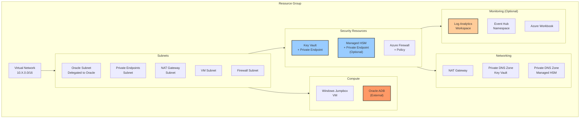

### Resource Breakdown

| Category | Resources | Purpose |
|----------|-----------|---------|
| **Networking** | VNet, 5 Subnets, NAT Gateway, Azure Firewall | Network isolation and connectivity |
| **Security** | Key Vault, Managed HSM (optional), Private Endpoints, Private DNS Zones | Key management and secure access |
| **Compute** | Windows VM (Jumpbox) | Management and testing access |
| **Database** | Oracle Autonomous Database | Target database with customer-managed keys |
| **Monitoring** | Log Analytics, Event Hub, Workbook | Observability and diagnostics (optional) |

## 🔐 Security Benefits

### Defense in Depth

```mermaid
flowchart LR
    subgraph Layer1["Network Security"]
        A1["Private Endpoints<br/>Only"]
        A2["No Public<br/>Internet"]
        A3["Azure Firewall<br/>Rules"]
    end
    
    subgraph Layer2["Identity & Access"]
        B1["Azure AD<br/>Authentication"]
        B2["RBAC & Access<br/>Policies"]
        B3["Managed<br/>Identities"]
    end
    
    subgraph Layer3["Data Protection"]
        C1["TDE with Customer<br/>Managed Keys"]
        C2["FIPS 140-3 L3<br/>HSM (Optional)"]
        C3["Key Rotation<br/>Policies"]
    end
    
    subgraph Layer4["Monitoring"]
        D1["Diagnostic<br/>Logs"]
        D2["Activity<br/>Tracking"]
        D3["Security<br/>Alerts"]
    end
    
    Layer1 --> Layer2 --> Layer3 --> Layer4
    
    style Layer1 fill:#f9f,stroke:#333,stroke-width:2px
    style Layer2 fill:#9ff,stroke:#333,stroke-width:2px
    style Layer3 fill:#9f9,stroke:#333,stroke-width:2px
    style Layer4 fill:#ff9,stroke:#333,stroke-width:2px
```

### Key Security Features

- **🔒 Zero Public Internet Exposure**: All key operations occur over private connectivity
- **🛡️ Network Isolation**: Keys never traverse the public internet
- **🔑 Customer-Managed Keys**: Full control over encryption key lifecycle
- **🏛️ Hardware Security**: 
  - Key Vault: FIPS 140-2 Level 2 validated hardware
  - Managed HSM: FIPS 140-3 Level 3 validated hardware
- **📊 Audit Trail**: Complete logging and monitoring capabilities
- **🔄 Automated Rotation**: 30-day key rotation with 7-day advance notification
- **🚫 Network ACLs**: Restricted access via IP rules and VNet integration

## 📋 Prerequisites

### Required Tools & Access

- **Azure Subscription** with permissions to create:
  - Resource Groups
  - Virtual Networks and Subnets
  - Key Vault / Managed HSM
  - Private Endpoints and DNS Zones
  - Virtual Machines
  - Log Analytics Workspace (optional)
  
- **Oracle Database@Azure** subscription and permissions

- **Terraform** >= 1.0
  - `azurerm` provider
  - `random` provider
  
- **Azure CLI** or **Azure PowerShell**

- **Networking Knowledge**:
  - VNets, subnets, address spaces
  - Private endpoints and private DNS zones
  - Network security groups and firewalls

### Recommended Skills

- Basic SQL and PL/SQL
- Understanding of Azure RBAC
- Familiarity with Infrastructure as Code (Terraform)
- Azure CLI >= 2.79.0
- Terraform >= 1.9.0 (tested with 1.13.5)
- jq (JSON processor) for parsing outputs
- Bash shell environment (macOS/Linux/WSL)

## 🚀 Quick Start

### Option 1: Automated Deployment Orchestrator (Recommended)

```bash
# 1. Clone the repository
git clone https://github.com/sihbher/odaa-akv-tests.git
cd odaa-akv-tests

# 2. Configure deployment
cp .env.example .env
# Edit .env with your Azure subscription, location, and passwords

# 3. Deploy with Azure Key Vault (default)
./deploy-exascale-demo.sh -akv

# Or deploy with Managed HSM (FIPS 140-2 Level 3)
./deploy-exascale-demo.sh -hsm

# Infrastructure only (review before applying)
./deploy-exascale-demo.sh --only-terraform

# Configure Managed HSM after infrastructure deployment
./deploy-exascale-demo.sh --only-configure-hsm
```

### Option 2: Manual Terraform Deployment

### 1. Clone the Repository

```bash
git clone https://github.com/sihbher/odaa-akv-tests.git
cd odaa-akv-tests/infra-deployment
```

### 2. Review and Customize Variables

```bash
cd infra-deployment
cp terraform.tfvars.example terraform.tfvars  # If example exists
# Edit terraform.tfvars with your values
```

Key variables to configure:

```hcl
location = "eastus"  # Azure region

# Feature flags
enable_log_analytics_logging = true   # Deploy Log Analytics & diagnostics
enable_eventhub_logging      = false  # Deploy Event Hub for log streaming
enable_managed_hsm           = false  # Deploy Managed HSM (in addition to Key Vault)

# Tagging
tags = {
  Environment = "Production"
  Project     = "Oracle-ADB-AKV"
  ManagedBy   = "Terraform"
  Owner       = "YourName"
}
```

### 3. Deploy Infrastructure

```bash
# Initialize Terraform
terraform init

# Preview changes
terraform plan

# Deploy (takes ~10-15 minutes)
terraform apply
```

### 4. Retrieve Outputs

After deployment completes:

```bash
# View all outputs
terraform output

# Get specific values
terraform output -json useful_info
terraform output key_vault_uri
terraform output mhsm_uri  # If Managed HSM enabled
```

## 🔄 Deployment Workflow

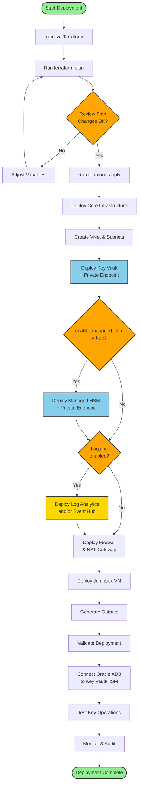

### Deployment Timeline

| Phase | Duration | Description |
|-------|----------|-------------|
| Infrastructure Planning | 2-5 min | Terraform initialization and planning |
| Core Network Deployment | 3-5 min | VNet, subnets, NSGs |
| Key Vault + Private Endpoint | 2-3 min | Key Vault and private connectivity |
| Managed HSM (Optional) | 5-7 min | HSM provisioning and activation |
| Monitoring Resources (Optional) | 2-3 min | Log Analytics, Event Hub |
| Firewall & VM | 3-5 min | Security appliances and jumpbox |
| **Total** | **10-20 min** | Complete infrastructure deployment |

## ⚙️ Configuration Options

### Feature Flags

Control what gets deployed using boolean variables:

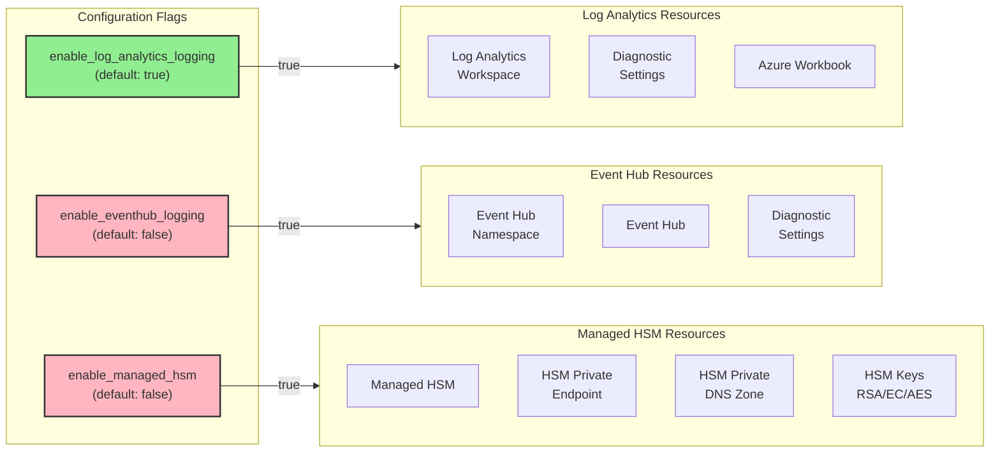

### Key Vault Keys

The deployment automatically creates multiple key types with rotation policies:

| Key Type | Sizes/Curves | Purpose | Rotation |
|----------|--------------|---------|----------|
| RSA | 2048, 3072, 4096 bit | Encryption, signing | 30 days |
| EC (Elliptic Curve) | P-256, P-256K, P-384, P-521 | Signing, verification | 30 days |

**Rotation Policy:**
- Expiry: 30 days (`P1M`)
- Notification: 7 days before expiry (`P7D`)
- Automatic rotation: 7 days before expiry (`P7D`)

### Managed HSM Keys (Optional)

When `enable_managed_hsm = true`, additional HSM-backed keys are created:

| Key Type | Sizes/Curves | Hardware Protection |
|----------|--------------|---------------------|
| RSA-HSM | 2048, 3072, 4096 bit | FIPS 140-3 Level 3 |
| EC-HSM | P-256, P-384, P-521 | FIPS 140-3 Level 3 |
| AES-HSM | 128, 192, 256 bit | FIPS 140-3 Level 3 |

### Network Configuration

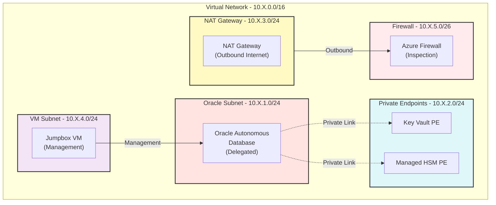

Customizable network settings:

```hcl
variable "vnet_octet_min" {
  default = 101  # Min value for 10.XXX.0.0/16
}

variable "vnet_octet_max" {
  default = 250  # Max value for 10.XXX.0.0/16
}

variable "oracle_subnet_prefix_length" {
    default = 29  # minimum subnet size
}
```


## 📁 Documentation Structure

```
repo/
├── README.md                           # Project index and quick start
├── DOCUMENTATION_GUIDE.md              # This file - detailed documentation
├── infra-deployment/                   # Terraform infrastructure code
│   ├── main.tf                         # Core networking (VNet, subnets)
│   ├── key_vault.tf                    # Key Vault + private endpoint + keys
│   ├── managed_hsm.tf                  # Managed HSM + keys (optional)
│   ├── firewall.tf                     # Azure Firewall
│   ├── firewall_policy.tf              # Firewall policies and rules
│   ├── nat_gateway.tf                  # NAT Gateway for outbound
│   ├── jumpbox_vm.tf                   # Windows management VM
│   ├── log_analytics.tf                # Log Analytics resources (optional)
│   ├── event_hub.tf                    # Event Hub resources (optional)
│   ├── workbook.tf                     # Azure Workbook (optional)
│   ├── variables.tf                    # Input variables and validation
│   ├── outputs.tf                      # Output values
│   ├── providers.tf                    # Provider configuration
│   └── locals.tf                       # Local values
└── .github/
    └── instructions/
        └── terraform-conventions.md    # Terraform coding standards
```

### Key Files Overview

| File | Purpose | Key Resources |
|------|---------|---------------|
| `main.tf` | Core networking infrastructure | VNet, Oracle Subnet, private endpoints subnet, VM subnet, NAT subnet, firewall subnet |
| `key_vault.tf` | Key Vault with private connectivity | Key Vault, access policies, RSA/EC keys, private endpoint, private DNS zone |
| `managed_hsm.tf` | Managed HSM (optional) | Managed HSM, HSM keys (RSA/EC/AES), private endpoint, DNS zone |
| `log_analytics.tf` | Observability (optional) | Log Analytics workspace, diagnostic settings, workbook |
| `event_hub.tf` | Event streaming (optional) | Event Hub namespace, event hub, diagnostic settings |
| `firewall.tf` | Firewall infrastructure | Azure Firewall, public IP, firewall configuration |
| `firewall_policy.tf` | Firewall rules | Firewall policy, rule collection groups, network/application rules |
| `jumpbox_vm.tf` | Management VM | Windows VM, NIC, NSG, public IP (optional) |
| `variables.tf` | Configuration inputs | All customizable parameters with validation |
| `outputs.tf` | Deployment results | Resource IDs, URIs, IP addresses, connection info |

## 🎯 Use Case Selection

### When to Use Key Vault

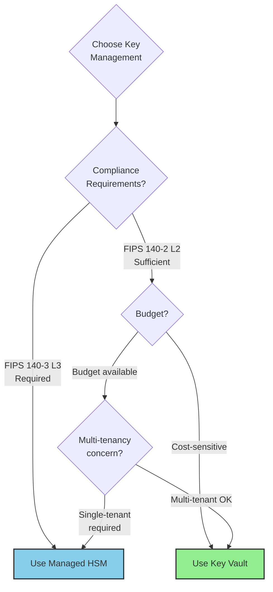

**✅ Use Azure Key Vault when:**

- Standard encryption requirements (FIPS 140-2 Level 2)
- Cost is a consideration (~$0.03 per 10,000 operations)
- Multi-tenant HSM is acceptable
- Shared service model works for your organization
- Quick deployment needed (2-3 minutes)
- Integration with other Azure services is priority

### When to Use Managed HSM

**✅ Use Azure Managed HSM when:**

- Strict compliance mandates (FIPS 140-3 Level 3)
- Single-tenant HSM hardware required
- Complete control over HSM is needed
- Budget supports premium security ($3-5/hour)
- Regulated industries: finance, healthcare, government
- Cryptographic operations must not share hardware

### Cost Comparison

| Feature | Key Vault | Managed HSM |
|---------|-----------|-------------|
| **Base Cost** | ~$0.03 per 10K operations | ~$3-5 per HSM per hour (~$2,200-3,600/month) |
| **Hardware** | Multi-tenant | Single-tenant dedicated |
| **FIPS Level** | 140-2 Level 2 | 140-3 Level 3 |
| **Deployment** | 2-3 minutes | 5-7 minutes |
| **Best For** | Most workloads | Highly regulated workloads |

## 🔍 Monitoring & Observability

When `enable_log_analytics_logging = true`:

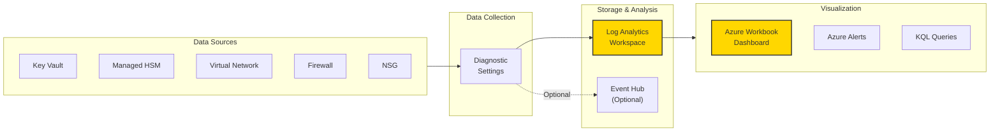

### Available Metrics & Logs

**Key Vault Diagnostics:**
- Audit events (key access, rotation)
- Performance metrics (latency, availability)
- Authentication logs
- Key operation logs (encrypt, decrypt, sign)

**Managed HSM Diagnostics:**
- HSM audit logs
- Key lifecycle events
- Access attempts and denials
- Performance metrics

**Network Diagnostics:**
- NSG flow logs
- Firewall logs (allowed/denied traffic)
- VNet diagnostic logs
- Private endpoint connectivity logs

### Sample Log Analytics Queries

```kusto
// Key Vault access audit
AzureDiagnostics
| where ResourceProvider == "MICROSOFT.KEYVAULT"
| where OperationName == "VaultGet" or OperationName == "SecretGet"
| summarize count() by CallerIPAddress, bin(TimeGenerated, 1h)

// Failed key operations
AzureDiagnostics
| where ResourceProvider == "MICROSOFT.KEYVAULT"
| where ResultType != "Success"
| project TimeGenerated, OperationName, ResultDescription, CallerIPAddress
```

## 🛠️ Terraform Module Structure

### Resource Dependencies

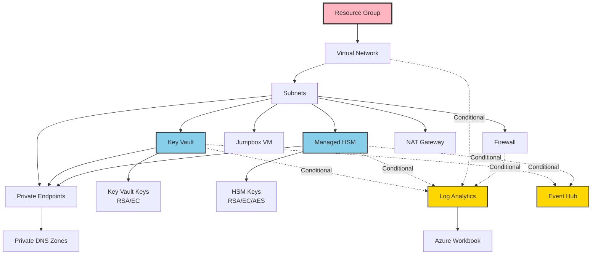

### Conditional Resource Deployment

Resources controlled by feature flags:

```hcl
# Log Analytics resources
resource "azurerm_log_analytics_workspace" "main" {
  count = var.enable_log_analytics_logging ? 1 : 0
  # ...
}

# Event Hub resources
resource "azurerm_eventhub_namespace" "main" {
  count = var.enable_eventhub_logging ? 1 : 0
  # ...
}

# Managed HSM resources
resource "azurerm_key_vault_managed_hardware_security_module" "mhsm" {
  count = var.enable_managed_hsm ? 1 : 0
  # ...
}
```

## 🔐 Security Hardening

### Network Security Best Practices

```mermaid
flowchart TD
    subgraph Perimeter["Perimeter Security"]
        FW["Azure Firewall<br/>+ Policies"]
        NSG["Network Security<br/>Groups"]
        NAT["NAT Gateway"]
    end
    
    subgraph Private["Private Connectivity"]
        PE["Private<br/>Endpoints"]
        DNS["Private DNS<br/>Resolution"]
        NoPublic["No Public IPs<br/>on Resources"]
    end
    
    subgraph Access["Access Control"]
        RBAC["Azure RBAC"]
        KVPolicy["Key Vault<br/>Access Policies"]
        HSMRoles["HSM Local<br/>RBAC"]
    end
    
    subgraph Encryption["Encryption"]
        TDE["TDE with<br/>CMK"]
        KeyRotation["Automated Key<br/>Rotation"]
        HSMKeys["HSM-backed<br/>Keys"]
    end
    
    subgraph Monitoring["Monitoring & Audit"]
        Logs["Diagnostic<br/>Logs"]
        Alerts["Security<br/>Alerts"]
        Audit["Audit<br/>Trail"]
    end
    
    Perimeter --> Private
    Private --> Access
    Access --> Encryption
    Encryption --> Monitoring
    
    style Perimeter fill:#FFEBEE,stroke:#333,stroke-width:2px
    style Private fill:#E3F2FD,stroke:#333,stroke-width:2px
    style Access fill:#F3E5F5,stroke:#333,stroke-width:2px
    style Encryption fill:#E8F5E9,stroke:#333,stroke-width:2px
    style Monitoring fill:#FFF3E0,stroke:#333,stroke-width:2px
```

### Implemented Security Controls

| Control | Implementation | Status |
|---------|---------------|---------|
| Network Isolation | Private Endpoints only | ✅ Implemented |
| Public Access | Disabled after deployment | ✅ Implemented |
| Firewall Rules | Azure Firewall with policies | ✅ Implemented |
| NSG Rules | Subnet-level restrictions | ✅ Implemented |
| Key Protection | FIPS 140-2 L2 / 140-3 L3 | ✅ Implemented |
| Key Rotation | 30-day automated rotation | ✅ Implemented |
| Access Control | RBAC + Access Policies | ✅ Implemented |
| Audit Logging | All operations logged | ✅ Implemented |
| Soft Delete | 7-day retention | ✅ Implemented |
| Purge Protection | Enabled on Key Vault/HSM | ✅ Implemented |

## 📊 Outputs Reference

After deployment, Terraform provides these outputs:

```hcl
# Resource identifiers
output "resource_group_name" {
  description = "Name of the resource group"
}

output "virtual_network_name" {
  description = "Name of the virtual network"
}

# Key management
output "key_vault_uri" {
  description = "URI of the Key Vault for Oracle ADB configuration"
}

output "key_vault_name" {
  description = "Name of the Key Vault"
}

output "mhsm_uri" {
  description = "URI of the Managed HSM (if enabled)"
}

# Connection information
output "useful_info" {
  description = "Map of important values including IPs, URIs, and identifiers"
  value = {
    resource_group_name = azurerm_resource_group.main.name
    virtual_network_name = azurerm_virtual_network.main.name
    key_vault_uri = azurerm_key_vault.main.vault_uri
    key_vault_name = azurerm_key_vault.main.name
    key_vault_private_ip = azurerm_private_endpoint.keyvault.private_service_connection[0].private_ip_address
    mhsm_uri = var.enable_managed_hsm ? azurerm_key_vault_managed_hardware_security_module.mhsm[0].hsm_uri : ""
    firewall_public_ip = azurerm_public_ip.firewall.ip_address
    firewall_private_ip = azurerm_firewall.main.ip_configuration[0].private_ip_address
    subscription_id = data.azurerm_client_config.current.subscription_id
    tenant_id = data.azurerm_client_config.current.tenant_id
    my_ip_address = chomp(data.http.my_public_ip.response_body)
  }
}
```

## 🧪 Testing & Validation

### Post-Deployment Validation Steps

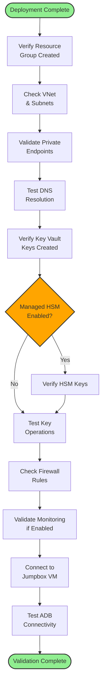

### Validation Commands

```bash
# 1. Verify resources exist
az group show --name <resource-group-name>
az network vnet show --resource-group <rg> --name <vnet-name>

# 2. Check Key Vault keys
az keyvault key list --vault-name <kv-name>
az keyvault key show --vault-name <kv-name> --name exascale-encryption-rsa-2048

# 3. Verify Managed HSM (if enabled)
az keyvault role assignment list --hsm-name <hsm-name>
az keyvault key list --hsm-name <hsm-name>

# 4. Test DNS resolution from VM
nslookup <keyvault-name>.vault.azure.net
nslookup <hsm-name>.managedhsm.azure.net

# 5. Check private endpoint connectivity
az network private-endpoint show --resource-group <rg> --name <pe-name>

# 6. Verify logging (if enabled)
az monitor log-analytics workspace show --resource-group <rg> --workspace-name <la-name>
```

## 🆘 Troubleshooting

### Common Issues & Solutions

| Issue | Cause | Solution |
|-------|-------|----------|
| **Key Vault access denied** | Missing access policy or RBAC | Grant appropriate permissions via access policy or RBAC |
| **Managed HSM "Not authorized"** | Missing HSM local RBAC role | Assign "Managed HSM Crypto User" role with `az keyvault role assignment create` |
| **Private endpoint not resolving** | DNS not configured | Verify private DNS zone is linked to VNet |
| **Terraform timeout** | Resource provisioning slow | Increase timeout in provider config or retry |
| **VM cannot reach Key Vault** | NSG or firewall blocking | Check NSG rules and firewall policies |
| **Key rotation not working** | Missing permissions | Add "Rotate", "SetRotationPolicy" to access policy |

### Debug Commands

```bash
# Check resource state
terraform show
terraform state list

# View diagnostic logs
az monitor diagnostic-settings list --resource <resource-id>

# Test network connectivity
az network watcher test-connectivity \
  --source-resource <vm-resource-id> \
  --dest-address <kv-private-ip> \
  --protocol Tcp --dest-port 443

# View Key Vault audit logs (requires Log Analytics)
az monitor log-analytics query \
  --workspace <workspace-id> \
  --analytics-query "AzureDiagnostics | where ResourceProvider == 'MICROSOFT.KEYVAULT' | take 10"
```


## 🤝 Support and Contributions

This guide is maintained for testing and validation purposes. For production deployments:

### Official Documentation

- 📘 [Oracle Autonomous Database Documentation](https://docs.oracle.com/en/cloud/paas/autonomous-database/serverless/adbsb/)
- 🔐 [Oracle ADB Encryption Keys](https://docs.oracle.com/en/cloud/paas/autonomous-database/serverless/adbsb/autonomous-encrypt-set-rotate-keys.html)
- 🔑 [Azure Key Vault with Oracle](https://docs.oracle.com/en/cloud/paas/autonomous-database/serverless/adbsb/encryption-keys-azure-key-vault.html)
- 🔒 [Azure Key Vault Best Practices](https://learn.microsoft.com/en-us/azure/key-vault/general/best-practices)
- 🛡️ [Azure Security Baseline - Key Vault](https://learn.microsoft.com/en-us/security/benchmark/azure/baselines/key-vault-security-baseline)

### Additional Resources

- 🔗 [Azure Key Vault Private Link](https://learn.microsoft.com/en-us/azure/key-vault/general/private-link-service)
- 🔗 [Azure Managed HSM Private Link](https://learn.microsoft.com/en-us/azure/key-vault/managed-hsm/private-link)
- 🌐 [Oracle Database@Azure Networking](https://learn.microsoft.com/en-us/azure/oracle/oracle-db/oracle-database-network-plan)
- 📚 [Terraform AzureRM Provider](https://registry.terraform.io/providers/hashicorp/azurerm/latest/docs)

## 📈 Roadmap & Future Enhancements

```mermaid
flowchart LR
    subgraph Current["Current State"]
        C1["✅ Key Vault Integration"]
        C2["✅ Managed HSM Support"]
        C3["✅ Private Endpoints"]
        C4["✅ Automated Rotation"]
    end
    
    subgraph Planned["Planned Features"]
        P1["🔄 Multi-region HA"]
        P2["📊 Enhanced Monitoring"]
        P3["🔐 Certificate Management"]
        P4["🤖 Automated Testing"]
    end
    
    subgraph Future["Future Considerations"]
        F1["☁️ Multi-cloud Keys"]
        F2["🔄 Disaster Recovery"]
        F3["📋 Compliance Reports"]
        F4["🎯 Performance Tuning"]
    end
    
    Current --> Planned --> Future
    
    style Current fill:#90EE90,stroke:#333,stroke-width:2px
    style Planned fill:#FFD700,stroke:#333,stroke-width:2px
    style Future fill:#87CEEB,stroke:#333,stroke-width:2px
```

## 📝 Changelog

### Version 1.0 (Current)
- ✅ Initial Terraform infrastructure
- ✅ Key Vault with private endpoints
- ✅ Managed HSM integration (optional)
- ✅ Multiple key types (RSA, EC, AES-HSM)
- ✅ Automated key rotation policies
- ✅ Log Analytics integration (optional)
- ✅ Event Hub streaming (optional)
- ✅ Azure Firewall configuration
- ✅ Jumpbox VM for management
- ✅ Comprehensive documentation

## 🎓 Learning Resources

### Terraform Tutorials

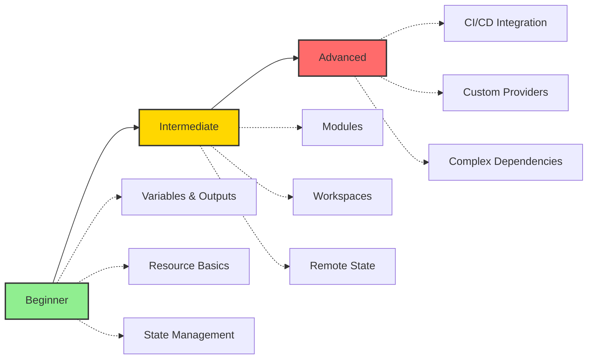

- 📖 [Terraform AzureRM Getting Started](https://learn.hashicorp.com/collections/terraform/azure-get-started)
- 🎥 [Azure Key Vault Tutorial](https://learn.microsoft.com/en-us/azure/key-vault/general/tutorial-net-create-vault-azure-web-app)
- 📚 [Managed HSM Quickstart](https://learn.microsoft.com/en-us/azure/key-vault/managed-hsm/quick-create-cli)

### Oracle Database@Azure

- 🔗 [Oracle Database@Azure Overview](https://www.oracle.com/cloud/azure/oracle-database-at-azure/)
- 📘 [Autonomous Database Features](https://www.oracle.com/autonomous-database/)
- 🔐 [Customer-Managed Keys Guide](https://docs.oracle.com/en/cloud/paas/autonomous-database/serverless/adbsb/autonomous-encrypt-set-rotate-keys.html)

## ⚖️ License

This project is provided as-is for testing and educational purposes. Please review and comply with:

- Oracle licensing terms for Database@Azure
- Microsoft Azure terms of service
- Terraform open-source license
- Your organization's security and compliance policies

## 🔒 Security Notice

**⚠️ Important Security Considerations:**

1. **Secrets Management**: Never commit sensitive values (keys, passwords, tokens) to version control
2. **State Files**: Store Terraform state in secure remote backend (Azure Storage with encryption)
3. **Access Control**: Implement least-privilege access for all resources
4. **Network Security**: Review and customize firewall rules for your environment
5. **Compliance**: Ensure deployment meets your organization's compliance requirements
6. **Regular Updates**: Keep Terraform providers and Azure resources updated
7. **Monitoring**: Enable and review diagnostic logs regularly
8. **Key Rotation**: Follow automated rotation policies and test rotation procedures
9. **Backup**: Implement backup and disaster recovery procedures
10. **Testing**: Test in non-production environments before deploying to production

## 📞 Getting Help

### Community Support

- 💬 GitHub Issues (for this repository)
- 📧 Azure Support (for Azure-related issues)
- 🌐 Oracle Support (for Database@Azure issues)
- 💡 Stack Overflow tags: `azure`, `terraform`, `oracle`, `key-vault`

### Professional Support

For production deployments requiring professional support:
- Contact Microsoft Azure Support
- Engage Oracle Cloud Support
- Consider Azure Architecture Review
- Professional Services for implementation

---

## 🔄 Recent Updates

### February 2026 - Bug Fix: Path Duplication Issue

**Problem**: Deployment script experienced path duplication bugs causing Terraform operations to fail:
```
/repo/infra-deployment/infra-deployment  # ❌ Incorrect - duplicated
```

**Root Cause**: Functions in `deploy/lib/terraform.sh` used `cd` without returning to original directory, affecting parent script context.

**Solution**: All library functions converted to use **subshells** for directory isolation:
```bash
# ✅ Correct approach (implemented)
terraform_init() {
    (
        cd "${tf_dir}" || exit 1
        terraform init
    )
}
```

**Impact**: Complete elimination of working directory side effects. All 8 Terraform functions in `deploy/lib/terraform.sh` updated.

**Documentation**: 
- Comprehensive bug fix details: [CHANGELOG_2026-02-03.md](./CHANGELOG_2026-02-03.md)
- Implementation summary: [SUMMARY_2026-02-03.md](./SUMMARY_2026-02-03.md)
- Library documentation: [deploy/lib/README.md](./deploy/lib/README.md)

### Known Issues

**HSM Configuration Script Hang**:
- **Status**: Identified, workaround available
- **Cause**: Missing Terraform output `managed_hsm` (only `useful_info.mhsm_uri` exists)
- **Impact**: Infrastructure deploys successfully, but HSM activation requires manual completion
- **Workaround**: Use Azure CLI to retrieve HSM name:
  ```bash
  az resource list --resource-type "Microsoft.KeyVault/managedHSMs" \
      --query "[?location=='eastus'].name" -o tsv
  ```
- **Fix**: Planned for next release

---

## 🎯 Quick Reference

### Deployment Orchestrator Commands

```bash
# Fresh deployment with Azure Key Vault
./deploy-exascale-demo.sh -akv

# Fresh deployment with Managed HSM
./deploy-exascale-demo.sh -hsm

# Infrastructure only (review plan first)
./deploy-exascale-demo.sh --only-terraform

# Configure existing HSM
./deploy-exascale-demo.sh --only-configure-hsm

# Generate tfvars for manual execution
./deploy-exascale-demo.sh --create-tfvars

# Destroy infrastructure
./deploy-exascale-demo.sh --destroy

# Help and options
./deploy-exascale-demo.sh --help
```

### Terraform Commands

```bash
# Initialize and deploy
terraform init
terraform plan
terraform apply

# View outputs
terraform output
terraform output -json useful_info

# Manage state
terraform state list
terraform show

# Cleanup
terraform destroy

# Validate configuration
terraform validate
terraform fmt

# Azure CLI essentials
az login
az account set --subscription <subscription-id>
az group list
az keyvault list
```

### Key Vault CLI Commands

```bash
# List keys
az keyvault key list --vault-name <kv-name>

# Get key details
az keyvault key show --vault-name <kv-name> --name <key-name>

# Create key manually
az keyvault key create \
  --vault-name <kv-name> \
  --name <key-name> \
  --kty RSA \
  --size 2048

# Set rotation policy
az keyvault key rotation-policy update \
  --vault-name <kv-name> \
  --name <key-name> \
  --value @rotation-policy.json
```

### Managed HSM CLI Commands

```bash
# List HSM keys
az keyvault key list --hsm-name <hsm-name>

# Create HSM key
az keyvault key create \
  --hsm-name <hsm-name> \
  --name <key-name> \
  --kty RSA-HSM \
  --size 2048

# Assign HSM role
az keyvault role assignment create \
  --hsm-name <hsm-name> \
  --role "Managed HSM Crypto User" \
  --assignee-object-id <object-id> \
  --assignee-principal-type User \
  --scope "/"
```

---

**Last Updated:** December 2025  
**Terraform Version:** >= 1.0  
**AzureRM Provider:** >= 3.0  

---

Made with ❤️ for secure cloud deployments


