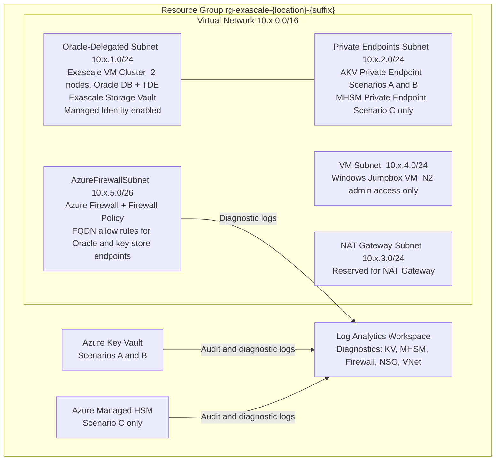
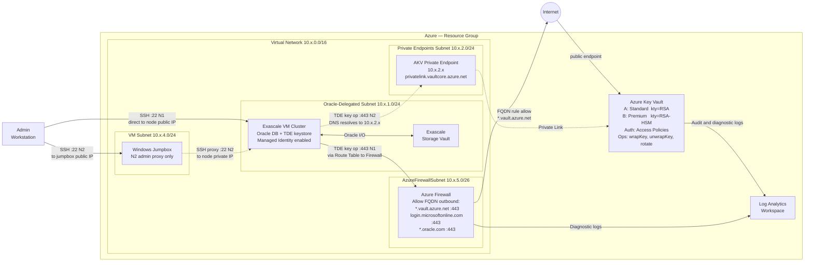
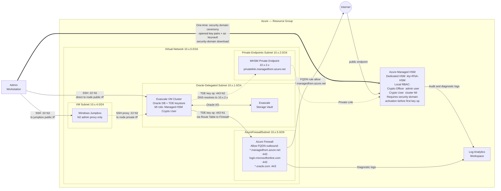

# Oracle Exascale + AKV Key Lifecycle — Manual Test Plan

Covers three scenarios for validating Oracle TDE key lifecycle management (choose keystore, create, rotate) against each supported Azure key store type:

- **Scenario A** — Azure Key Vault Standard + Exascale
- **Scenario B** — Azure Key Vault Premium + Exascale
- **Scenario C** — Azure Managed HSM + Exascale

---

## Prerequisites

### Tools required
- Azure CLI (`az`) logged in to the target subscription
- Terraform >= 1.9.0
- `jq`
- SSH key pair for Exascale cluster node access
- `openssl` (Scenario C only — security domain ceremony)

### Baseline `.env` for all scenarios

```bash
cp .env.example .env
```

Set the following in `.env` before starting any scenario:

```bash
AZ_LOCATION=eastus          # or your target region
DEPLOY_EXASCALE=true
ORACLE_SSH_PUBLIC_KEY="ssh-rsa AAAA... user@host"   # paste full one-line output of: cat ~/.ssh/exascale-key.pub
KEY_VAULT_PUBLIC_NETWORK_ACCESS=true                 # default for N1; set false for N2 private-only access
```

---

## Networking Variants

Every scenario can be tested in two networking configurations. Choose one before deploying.

### Option N1 — Public networking (simpler, dev/test)

The Key Vault (and MHSM) is reachable over the public internet. Exascale nodes connect to `*.vault.azure.net` / `*.managedhsm.azure.net` outbound through the Azure Firewall. Admin SSH access uses the node's public IP (or NAT Gateway IP if nodes are behind NAT).

`.env` additions:
```bash
# Nothing extra — public_network_access_enabled defaults to true in key_vault.tf
# Firewall application rules already permit *.vault.azure.net on port 443
```

### Option N2 — Private networking (production-like)

The Key Vault / MHSM is locked to Private Endpoint only (`public_network_access_enabled = false`). Oracle nodes reach the keystore exclusively through the VNet private endpoint. Admin SSH access is proxied through the deployed Windows Jumpbox VM.

`.env` additions:
```bash
KEY_VAULT_PUBLIC_NETWORK_ACCESS=false   # disable public AKV access
```

Or set the Terraform variable directly:
```bash
export TF_VAR_key_vault_public_network_access=false
```

> **Note:** With private networking, the Azure Firewall application rules for `*.vault.azure.net` are **not** used for Oracle → AKV traffic (which flows through the private endpoint). The Firewall rules remain in place for other outbound traffic.

### Connecting to Exascale nodes — Public vs. Private

**Public (Option N1):** Nodes are accessible via their public IP or through the NAT Gateway:
```bash
NODE_IP=$(az network public-ip list -g "$RG" \
  --query "[?contains(name,'exascale')].ipAddress" -o tsv | head -1)
ssh -i ~/.ssh/exascale-key opc@"$NODE_IP"
```

**Private (Option N2):** Connect through the Jumpbox VM deployed by the infra:
```bash
# 1. Get Jumpbox public IP
JUMPBOX_IP=$(terraform output -json useful_info | jq -r '.jumpbox_public_ip')

# 2. Get an Exascale node private IP
NODE_PRIV_IP=$(az network nic list -g "$RG" \
  --query "[?contains(name,'exascale')].ipConfigurations[0].privateIPAddress" \
  -o tsv | head -1)

# 3. SSH via jumpbox as a proxy
ssh -i ~/.ssh/exascale-key \
  -o ProxyCommand="ssh -W %h:%p -i ~/.ssh/exascale-key opc@$JUMPBOX_IP" \
  opc@"$NODE_PRIV_IP"
```

---

## Network Architecture Diagrams

The diagrams below show how TDE key-operation traffic flows for each scenario under both networking options.

**Arrow legend**
| Style | Meaning |
|---|---|
| `→` solid | **N1 — Public networking**: TDE traffic exits through Azure Firewall to the key store's public endpoint |
| `-.->` dashed | **N2 — Private networking**: TDE traffic stays inside the VNet via Private Endpoint |
| `==>` thick | One-time administrative action (Scenario C security domain ceremony only) |

Before every key operation, Oracle fetches a bearer token from the Azure Instance Metadata Service (`http://169.254.169.254`) using the Exascale cluster's Managed Identity. This step is identical in both N1 and N2 and is not shown separately in the diagrams.

---

### Shared VNet layout (all scenarios)



---

### Scenarios A and B — Azure Key Vault (Standard / Premium)

The VNet topology and data-flow paths are **identical** for both SKUs. The SKU affects only the key-protection model: Standard keys are software-protected (`kty=RSA`); Premium keys are HSM-backed inside the shared vault (`kty=RSA-HSM`).



**Key observations:**
- N1: the Firewall FQDN application rule for `*.vault.azure.net` is the enforcement point; removing this rule blocks Oracle from reaching AKV.
- N2: the Private DNS zone (`privatelink.vaultcore.azure.net`) is linked to the VNet automatically by Terraform. When `KEY_VAULT_PUBLIC_NETWORK_ACCESS=false`, the AKV public endpoint returns HTTP 403 for any request not arriving via Private Link.

---

### Scenario C — Azure Managed HSM

Scenario C replaces the shared Key Vault with a **dedicated** HSM. Authentication switches from Access Policies to **MHSM local RBAC**. A one-time security domain ceremony (step C3) must activate the MHSM before any key operations are possible; the Exascale cluster's Managed Identity is then granted **Managed HSM Crypto User**.



**Key observations:**
- N1: the Firewall FQDN rule must reference `*.managedhsm.azure.net` (not `*.vault.azure.net`). Oracle resolves the keystore type from the credential URI (`https://<name>.managedhsm.azure.net`).
- N2: the Private DNS zone is `privatelink.managedhsm.azure.net`. Oracle TDE commands work identically to Scenarios A/B; only the external store credential URI changes.
- Security domain ceremony is a **blocking prerequisite** — key creation (step C5) will fail until the MHSM status shows `Active`.

---

## Scenario A — AKV Standard + Exascale

### A1. Deploy infrastructure

```bash
./deploy-exascale-demo.sh -exascale
# KEY_VAULT_SKU defaults to standard — no .env change needed
```

Expected duration: ~3–4 h (Exascale cluster provision dominates).

### A2. Capture outputs

```bash
cd infra-deployment
AKV_NAME=$(terraform output -json useful_info | jq -r '.akv_name')
AKV_URI=$(terraform output -json useful_info  | jq -r '.akv_uri')
SCAN_DNS=$(terraform output -json exascale_vm_cluster | jq -r '.scan_dns_name')
RG=$(terraform output -json resource_group | jq -r '.name')
```

### A3. Confirm pre-created AKV keys exist

```bash
az keyvault key list --vault-name "$AKV_NAME" -o table
# Expect: exascale-encryption-rsa-2048, exascale-encryption-rsa-3072, exascale-encryption-rsa-4096
```

### A4. Connect to an Exascale node

Use the method that matches your chosen networking option (see [Networking Variants](#networking-variants) above).

**Public (N1):**
```bash
NODE_IP=$(az network public-ip list -g "$RG" \
  --query "[?contains(name,'exascale')].ipAddress" -o tsv | head -1)
ssh -i ~/.ssh/exascale-key opc@"$NODE_IP"
```

**Private (N2 — via Jumpbox):**
```bash
JUMPBOX_IP=$(terraform output -json useful_info | jq -r '.jumpbox_public_ip')
NODE_PRIV_IP=$(az network nic list -g "$RG" \
  --query "[?contains(name,'exascale')].ipConfigurations[0].privateIPAddress" \
  -o tsv | head -1)
ssh -i ~/.ssh/exascale-key \
  -o ProxyCommand="ssh -W %h:%p -i ~/.ssh/exascale-key opc@$JUMPBOX_IP" \
  opc@"$NODE_PRIV_IP"
```

### A4b. (Option N2 only) Verify Private Endpoint DNS resolution

Before opening the Oracle keystore, confirm the node resolves the AKV hostname to a **private IP**, not a public one:

```bash
# On the Exascale node:
nslookup ${AKV_NAME}.vault.azure.net
# Expected output:
#   Address: 10.x.x.x   ← private IP from the PE subnet (10.106.x.x)
# If you see a public IP (13.x.x.x / 40.x.x.x), PE DNS is not propagated yet.
```

From SQL*Plus, confirm Oracle can reach AKV over the private path:
```sql
-- Resolves AKV FQDN from inside the database
SELECT UTL_INADDR.GET_HOST_ADDRESS('${AKV_NAME}.vault.azure.net') FROM DUAL;
-- Must return a 10.x.x.x private IP
```

For public networking (N1), the same check should return a public IP, which is expected:
```bash
nslookup ${AKV_NAME}.vault.azure.net
# Expected: a public IP (e.g. 13.x.x.x) — acceptable for N1 only
```

### A5. Configure Oracle external keystore pointing at AKV

```bash
# On the node — become oracle user
sudo su - oracle
```

```sql
sqlplus / as sysdba

-- Check current TDE wallet/keystore
SELECT STATUS, WALLET_TYPE FROM v$encryption_wallet;

-- Point Oracle at AKV as the external keystore
ADMINISTER KEY MANAGEMENT SET KEYSTORE IDENTIFIED BY EXTERNAL STORE;

-- Open the external keystore for this instance
ADMINISTER KEY MANAGEMENT SET KEYSTORE OPEN IDENTIFIED BY EXTERNAL STORE CONTAINER=ALL;

-- Verify it is OPEN
SELECT STATUS, WALLET_TYPE FROM v$encryption_wallet;
-- Expected: OPEN, EXTERNAL
```

### A6. Create (set) the TDE master encryption key in AKV

```sql
ADMINISTER KEY MANAGEMENT SET KEY IDENTIFIED BY EXTERNAL STORE CONTAINER=ALL;

-- Confirm the new key is active
SELECT KEY_ID, CREATOR, CREATION_TIME, ACTIVATION_TIME
FROM v$encryption_keys
ORDER BY CREATION_TIME DESC;
```

### A7. Verify the key landed in AKV

```bash
# Run from your workstation (not the Oracle node)
az keyvault key list-versions \
  --vault-name "$AKV_NAME" \
  --name exascale-encryption-rsa-2048 -o table
# A new version created by Oracle should be present
```

**(Option N2) Also confirm AKV rejects public access:**
```bash
# From outside the VNet (your workstation), attempt direct access:
curl -s -o /dev/null -w "%{http_code}" \
  "https://${AKV_NAME}.vault.azure.net/keys?api-version=7.4"
# Expected with N2: 403 (Forbidden) — public access is blocked
# Expected with N1: 200 or 401 (reachable)
```

### A8. Rotate the TDE master key

```sql
-- Same command creates a new key version and makes it active
ADMINISTER KEY MANAGEMENT SET KEY IDENTIFIED BY EXTERNAL STORE CONTAINER=ALL;

SELECT KEY_ID, ACTIVATION_TIME
FROM v$encryption_keys
ORDER BY CREATION_TIME DESC
FETCH FIRST 3 ROWS ONLY;
```

### A9. Verify rotation in AKV

```bash
az keyvault key list-versions \
  --vault-name "$AKV_NAME" \
  --name exascale-encryption-rsa-2048 -o table
# A new version with a later Created timestamp should appear
```

### A10. Teardown

```bash
./deploy-exascale-demo.sh --destroy
```

---

## Scenario B — AKV Premium + Exascale

### B0. Set Premium SKU in `.env`

```bash
KEY_VAULT_SKU=premium
```

### B1–B9. Follow identical steps A1–A9.

### Additional Premium-specific check (after step B3)

```bash
# Confirm keys are HSM-backed
az keyvault key show \
  --vault-name "$AKV_NAME" \
  --name exascale-encryption-rsa-2048 \
  --query '{kty:key.kty, hsmBacked:attributes.hsmBacked}' -o json
# Premium: "hsmBacked": true, "kty": "RSA-HSM"
# Standard: "hsmBacked": false, "kty": "RSA"
```

### B10. Teardown

```bash
# Reset SKU to standard before next scenario
KEY_VAULT_SKU=standard   # in .env
./deploy-exascale-demo.sh --destroy
```

---

## Scenario C — Managed HSM + Exascale

> **Note:** MHSM provisioning takes ~15 min and requires a one-time **security domain ceremony** before any keys can be created. MHSM billing starts immediately after provisioning.

### C1. Deploy infrastructure

```bash
./deploy-exascale-demo.sh -exascale-hsm
# Sets DEPLOY_MANAGED_HSM=true + DEPLOY_EXASCALE=true
```

### C2. Capture HSM output

```bash
cd infra-deployment
HSM_NAME=$(terraform output -json managed_hsm | jq -r '.name')
RG=$(terraform output -json resource_group | jq -r '.name')
```

### C3. Activate the MHSM (security domain ceremony)

```bash
# Generate three officer key pairs (one is sufficient for a test environment)
openssl req -newkey rsa:2048 -nodes -keyout cert_1.key -x509 -days 365 -out cert_1.cer
openssl req -newkey rsa:2048 -nodes -keyout cert_2.key -x509 -days 365 -out cert_2.cer
openssl req -newkey rsa:2048 -nodes -keyout cert_3.key -x509 -days 365 -out cert_3.cer

# Download security domain (quorum = 2 of 3)
az keyvault security-domain download \
  --hsm-name "$HSM_NAME" \
  --sd-wrapping-keys cert_1.cer cert_2.cer cert_3.cer \
  --sd-quorum 2 \
  --security-domain-file security-domain.json

# Confirm MHSM is now Active
az keyvault show --hsm-name "$HSM_NAME" --query properties.statusMessage -o tsv
# Expected: The Managed HSM is provisioned and ready to use.
```

**Alternative:** use the built-in HSM configurator (automates C3–C4):

```bash
./deploy-exascale-demo.sh --only-configure-hsm
```

### C4. Assign RBAC roles to yourself

```bash
CURRENT_USER=$(az ad signed-in-user show --query id -o tsv)

az keyvault role assignment create \
  --hsm-name "$HSM_NAME" \
  --role "Managed HSM Crypto Officer" \
  --assignee "$CURRENT_USER" \
  --scope /keys

az keyvault role assignment create \
  --hsm-name "$HSM_NAME" \
  --role "Managed HSM Crypto User" \
  --assignee "$CURRENT_USER" \
  --scope /keys
```

### C5. Create an RSA-HSM key in the MHSM

```bash
az keyvault key create \
  --hsm-name "$HSM_NAME" \
  --name exascale-tde-key \
  --kty RSA-HSM \
  --size 2048 \
  --ops wrapKey unwrapKey

az keyvault key show --hsm-name "$HSM_NAME" --name exascale-tde-key -o table
```

### C6. Assign Crypto User role to the Exascale cluster's Managed Identity

```bash
CLUSTER_MI=$(az resource show \
  --ids "$(cd infra-deployment && terraform output -json exascale_vm_cluster | jq -r '.id')" \
  --query identity.principalId -o tsv)

az keyvault role assignment create \
  --hsm-name "$HSM_NAME" \
  --role "Managed HSM Crypto User" \
  --assignee "$CLUSTER_MI" \
  --scope /keys
```

### C7–C10. SSH to Oracle node — same key lifecycle commands as Scenario A

Repeat steps A4–A8. The Oracle SQL commands (`ADMINISTER KEY MANAGEMENT`) work identically for AKV and MHSM; Oracle resolves the keystore type from the external store credential pointing at the MHSM URI (`https://<name>.managedhsm.azure.net`).

### C11. Verify rotation via MHSM CLI

```bash
az keyvault key rotate --hsm-name "$HSM_NAME" --name exascale-tde-key

az keyvault key list-versions \
  --hsm-name "$HSM_NAME" \
  --name exascale-tde-key -o table
```

### C12. Teardown

```bash
./deploy-exascale-demo.sh --destroy
```

---

## Test Checklist

Repeat this checklist once per networking option (N1 = Public, N2 = Private).

| Step | A (Standard) | B (Premium) | C (MHSM) |
|------|:---:|:---:|:---:|
| **Networking — N1 (Public)** | | | |
| Infra deploys cleanly | ☐ | ☐ | ☐ |
| AKV/MHSM key visible after deploy | ☐ | ☐ | ☐ |
| Premium: keys show `kty=RSA-HSM` | — | ☐ | — |
| MHSM: security domain activated | — | — | ☐ |
| Node reachable via public IP | ☐ | ☐ | ☐ |
| AKV FQDN resolves to public IP from node | ☐ | ☐ | ☐ |
| Oracle keystore opens (`OPEN / EXTERNAL`) | ☐ | ☐ | ☐ |
| TDE MEK created in AKV/MHSM | ☐ | ☐ | ☐ |
| New key version visible in AKV/MHSM | ☐ | ☐ | ☐ |
| Rotation creates additional version | ☐ | ☐ | ☐ |
| Rotated key active in `v$encryption_keys` | ☐ | ☐ | ☐ |
| Destroy completes cleanly | ☐ | ☐ | ☐ |
| **Networking — N2 (Private)** | | | |
| Infra deploys cleanly | ☐ | ☐ | ☐ |
| AKV/MHSM key visible after deploy | ☐ | ☐ | ☐ |
| Node reachable via Jumpbox SSH proxy | ☐ | ☐ | ☐ |
| AKV FQDN resolves to **private** IP from node | ☐ | ☐ | ☐ |
| AKV **rejects** direct public access (HTTP 403) | ☐ | ☐ | ☐ |
| Oracle keystore opens (`OPEN / EXTERNAL`) | ☐ | ☐ | ☐ |
| TDE MEK created in AKV/MHSM | ☐ | ☐ | ☐ |
| New key version visible in AKV/MHSM | ☐ | ☐ | ☐ |
| Rotation creates additional version | ☐ | ☐ | ☐ |
| Rotated key active in `v$encryption_keys` | ☐ | ☐ | ☐ |
| Destroy completes cleanly | ☐ | ☐ | ☐ |

---

## Key differences between the three scenarios

| | Standard | Premium | MHSM |
|---|---|---|---|
| Key protection | Software | HSM chip inside shared AKV | Dedicated HSM |
| `kty` in Azure | `RSA` | `RSA-HSM` | `RSA-HSM` |
| Deploy flag | `-exascale` | `-exascale` + `KEY_VAULT_SKU=premium` in `.env` | `-exascale-hsm` |
| Extra activation step | No | No | Yes — security domain ceremony |
| Azure auth model | Access Policies | Access Policies | MHSM local RBAC roles |
| Approximate extra cost | Baseline | ~20% higher key operations | Dedicated HSM charge (~$5/h) |

## Networking comparison

| | N1 — Public | N2 — Private |
|---|---|---|
| AKV / MHSM reachable from internet | Yes | No (HTTP 403) |
| Oracle → AKV path | Public internet via Firewall FQDN rule | Private Endpoint inside VNet |
| AKV DNS resolution from node | Public IP (e.g. `40.x.x.x`) | Private IP (e.g. `10.x.x.x`) |
| Admin SSH to Exascale node | Direct to node IP | Via Jumpbox SSH proxy |
| `.env` setting | (default) | `KEY_VAULT_PUBLIC_NETWORK_ACCESS=false` |
| Use case | Dev / testing | Production / compliance |
| Private DNS zone required | No | Yes — deployed automatically by Terraform |


